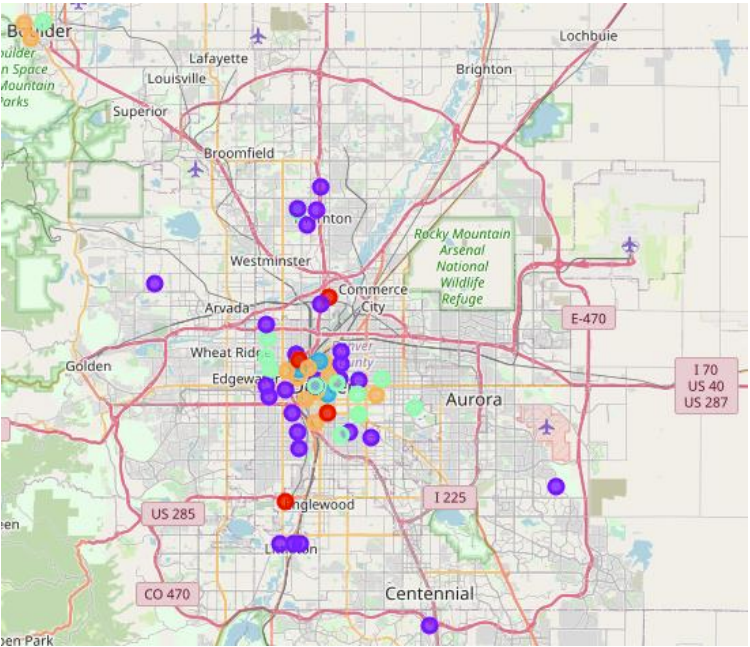

# Battle of the Neighborhoods | IBM Data Science Capstone Project

---
## Contents

* [Applied Data Science Capstone Notebook - Final Notebook](https://github.com/gabeo13/IBM_Coursera_DS_Capstone/blob/master/Applied%20Data%20Science%20Capstone.ipynb)

* [The Battle of the Neighborhoods - Final Report](https://github.com/gabeo13/IBM_Coursera_DS_Capstone/blob/master/The%20Battle%20of%20the%20Neighborhoods%20-%20Report%20Final%20-Wk5.pdf)

* [The Battle of the Neighborhoods - Final Presentation](https://github.com/gabeo13/IBM_Coursera_DS_Capstone/blob/master/The%20Battle%20of%20the%20Neighborhoods%20-%20Presentation%20Final%20-%20Wk5.pdf)

---
## Background & Challenge
One of the most favored consumables the world over is beer, and that is no different in the United States. According to [usatoday.com](https://www.usatoday.com/story/money/2019/09/14/how-much-beer-did-the-average-person-drink-in-every-state/40109241/), the average American consumes 26.2 gallons of beer per year. 

Our fictitious brewing company “Big yEAST” has been a staple on the 
eastern seaboard for several decades. A recent evaluation of regional 
market trends has shown a decline in total consumption of beer, especially with the key demographic of (25-34-year-old individuals). Bill Barley, the President & CEO of Big yEAST, has commissioned a high-level exploratory market review of several locations in the western United States in the hope that Big yEAST can establish a position in either a developed or emerging market with the presence of a local brewery.

---
## Technical Toolkit

>* [FOURSQUARE Places API](https://foursquare.com/products/places/)
>* Python
>* Pandas
>* sklearn
>* folium
>* matplotlib
>* requests
>* geopy

---
## Map of Results

